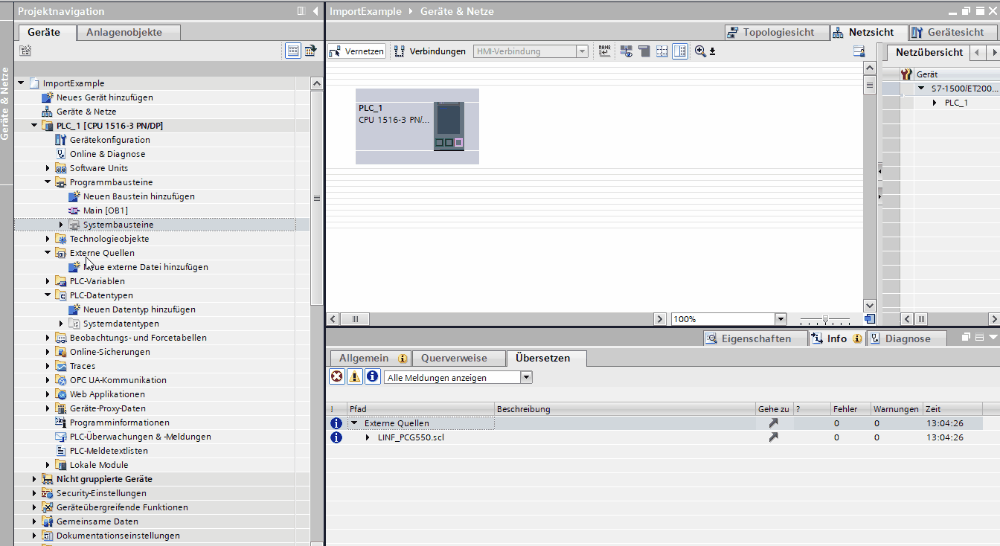
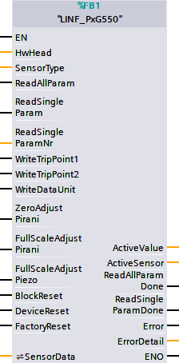

# PxG55x Profinet examples

Fieldbus examples for the PXG55X family with an S7-15xx and a Profinet device

## General Information

The prefix LINF\_ is used for all functionsblocks and datatypes.

## Tested HW & SW

This project was tested under the following hardware & software:

- S7-1516 with FW2.9
- SIMATIC STEP 7 Professional V18 (TIA PORTAL)

## How to import sourcecode in to TIA

The .scl file in the sources folder contains the data type & function block for TIA.  
To import the file, go to your PLC->external sources->new external file.  
Right click on the file and select "Generate blocks from file".  

# Program blocks

## LINF_PCG550

Autor: Software R&D Inficopn AG

### Short description

This block handles all the cyclic and acyclic data of a PCG55x series sensor.  
Please see the sensor manual for details of the sensor.

### Block Interface

#### Input parameter

| Identifier            | Data type | Description                                                                                                                                                        |
| --------------------- | --------- | ------------------------------------------------------------------------------------------------------------------------------------------------------------------ |
| HwHead                | HW_ANY    | needs to be linked to pressuregauge~Head   you can find this value in your hardwareconfig --> device view --> "your sensor" --> properties --> system constants |
| SensorType            | UINT      | 1 = PSC, 2 = PCG                                                                                                                                                   |
| ReadAllParam          | Bool      | Read All Parameters, parameters are then stored in SensorData.AcyclicReadData                                                                                   |
| ReadSingleParam       | Bool      | Read a Single Parameter from the sensor.                                                                                                                           |
| ReadSingleParamNr     | UINT      | Defines the Parameter for ReadSingleParam,   you can get the number from the constans in the source, Prefix is: ACYCLIC                                         |
| WriteTripPoint1       | Bool      | Writes all Parameter for TripPoint1 to the sensor, parameters are defined in SensorData.AcyclicWriteData.TripPoint[1]                                              |
| WriteTripPoint2       | Bool      | Writes all Parameter for TripPoint2 to the sensor, parameters are defined in SensorData.AcyclicWriteData.TripPoint[2]                                              |
| WriteDataUnit         | Bool      | Write the DataUnit defined in SensorData.AcyclicWriteData.DataUnit to the sensor                                                                                   |
| ZeroAdjustPirani      | Bool      | Performs a ZeroAdjustment for the Pirani sensor, see manual for further instructions                                                                               |
| FullScaleAdjustPirani | Bool      | Performs a Full Scale Adjustemt for the Pirani sensor                                                                                                              |
| FullScaleAdjustPiezo  | Bool      | erforms a Full Scale Adjustemt for the Pirani sensor                                                                                                               |
| BlockReset            | Bool      | Resets internal Error of the block                                                                                                                                 |
| DeviceReset           | Bool      | Execution of this command causes the device to emulate a complete power cycle                                                                                      |
| FactoryReset          | Bool      | Factory reset, Device Reset and all parameters are restored to as-shipped defaults. PN name and IP are retained                                                    |

#### Output parameter

| Identifier          | Data type | Description                                                                |
| ------------------- | --------- | -------------------------------------------------------------------------- |
| ActiveValue         | Real      | cyclic Gauge Active Value                                                  |
| Active Sensor       | UInt      | Gauge Active Sensor Number  PSG: 1 = Pirani PCG: 1 = CDG, 2 = Pirani |
| ReadAllParamDone    |           |                                                                            |
| ReadSingleParamDone |           |                                                                            |
| Error               | Bool      | FALSE: No Error, TRUE: Error Active                                        |
| ErrorDetail         | WORD      | Refer to the ErrorDetail table for further explanation                     |

#### In/Out parameter

| Identifier | Data type         | Description                                |
| ---------- | ----------------- | ------------------------------------------ |
| SensorData | LInf_type_PCG550" | contains all acyclic data and command sets |

### Error handling

There are three kind of errors in the block.

- internal block errors
- errors from called blocks
- device errors

Internal block errors must be reset via the block reset input.  
Errors from called blocks are stored under the specific struct in the block, they are stored because they are often only present for a single cycle, for example the last error from RDREC is stored in RdRec.stsSavedError. See the TIA manual for more details.  
For the category Device Errors, always refer to the manual of the specific device. If you have found the cause, it is possible to reset the device using the DeviceReset input of the function. It is also possible to perform a factory reset.

### ErrorDetail table

All Values are in HEX

| Value | Explanation                                                                |
| ----- | -------------------------------------------------------------------------- |
| 0000  | No Error present                                                           |
| 8011  | Error of called function Block Dprd_dat while reading slot trippoint       |
| 8012  | Error of called function Block Dprd_dat while reading slot activevalue     |
| 8013  | Error of called function Block Dprd_dat while reading slot activesensor    |
| 8014  | Error of called function Block Dprd_dat while reading slot activeexception |
| 8020  | Error of called function Block RDREC                                       |
| 8021  | Error of called function Block WRREC                                       |
| 8140  | Error in device during full scale adjustment of the piezo sensor           |
| 8041  | Error in device during zero adjustment of the pirano sensor                |
| 8042  | Error in device during full scale adjustment of the pirano sensor          |

### TripPoint configuration

There are 2 Trippoints avaiable in the device. The configuration is made trough SensorData.AcyclicWriteData.TripPoint
Configuration of each parameter is described in the Profinetmanual of the Sensor.

| Name                     | Data type | Description |
| ------------------------ | --------- | ----------- |
| HighTripEnable           | USInt     |             |
| LowTripEnable            | USInt     |             |
| HighTripPointLimit       | Real      |             |
| LowTripPointLimit        | Real      |             |
| HighTripSourceIndex      | UInt      |             |
| LowTripSourceIndex       | UInt      |             |
| PercentageHighTripSource | Real      |             |
| PercentageLowTripSource  | Real      |             |
| HighTripHysteresis       | Real      |             |
| LowTripHysteresis        | Real      |             |

### Change Log

| Version & Date | Change Description |
| -------------- | ------------------ |
| 00.00.01       | first release      |
